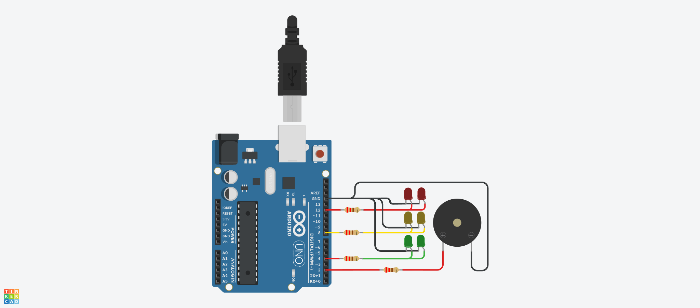

# Dojo N°1 (Parte 1) Semaforo

## Integrantes 
- Spatola Mateo
- Videla Ribodino Ivan
- Manzanares Patricio
- Quiroga Joaquin
- Santa Eulalia Matias

## Proyecto: Semaforo.

## Descripción
Este es el código correspondiente al Dojo 1 del Grupo C. En este código se utiliza un Arduino para controlar la iluminación de tres LEDs (Rojo, Amarillo y Verde) y un timbre. El objetivo del Dojo fue familiarizarse con la programación en Arduino y la interacción con componentes electrónicos.

Consignas Parte 1:
- El semáforo tiene que tener 2 leds de cada color como mínimo, en caso de que uno se  rompa. 
- Tiene que implementar los tiempos correctos como se detallan a continuación. 
- El verde dura 5 segundos. 
- El amarillo dura 3 segundos. 
- Rojo dura 5 segundos. 
- Tiene que tener señalización para personas no videntes como se detalla a  continuación. (Buzzer o piezo)
- Durante el rojo: Tiene que sonar 2 vez por segundo en un tono FUERTE. 

## Función principal
El código hace uso de varias funciones para controlar los LEDs y el timbre. La función prenderUnTiempoConSonido se encarga de encender el LED Rojo e iterar un sonido, mientras que la funcion prenderUnTiempo se encarga de encender y apagar el resto de los LEDs con un delay especificado.

~~~ C (lenguaje en el que esta escrito)
void prenderUnTiempoConSonido(int led, int tiempo)
{
  int segundos = 0;
  digitalWrite(led, HIGH);
  while(segundos < tiempo)
  {
    iterarSonido(BUZZER,1500,200,300);
    iterarSonido(BUZZER,1500,200,300);
    segundos += 1000;
  }
 digitalWrite(led, LOW);
}
~~~

~~~ C (lenguaje en el que esta escrito)
void prenderUnTiempo(int led, int tiempo)
{
  digitalWrite(led, HIGH);
  delay(tiempo);
  digitalWrite(led, LOW);
}
~~~

La función iterarSonido hace sonar el timbre dos veces en un lapso de 1000ms.

~~~ C (lenguaje en el que esta escrito)
void iterarSonido(int bocina,int frecuencia, int tiempoSonando, int tiempoApagado)
{
  Serial.println("Suena el timbre");
  tone(bocina,frecuencia,tiempoSonando);
  delay(tiempoApagado);
}
~~~

En el loop principal del código, se enciende el LED Rojo y se hace sonar el timbre por 5 segundos. Luego, se enciende el LED Amarillo por 3 segundos, seguido del LED Verde por 5 segundos y finalmente, se enciende el LED Amarillo por otros 3 segundos.

## :robot: Link al proyecto
- [Proyecto](https://www.tinkercad.com/things/fTPPUWMKD0W)

> Recomendación: Al iniciar simulación bajar volumen.
