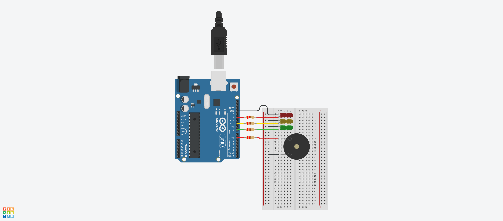

# Dojo N°1 (Parte 2) Semaforo

## Integrantes 
- Spatola Mateo
- Videla Ribodino Ivan
- Manzanares Patricio
- Quiroga Joaquin
- Santa Eulalia Matias

## Proyecto: Semaforo.

## Descripción
Este es el código correspondiente al Dojo 1 del Grupo C. En este código se utiliza un Arduino para controlar la iluminación de tres LEDs (Rojo, Amarillo y Verde) y un timbre. El objetivo del Dojo fue familiarizarse con la programación en Arduino y la interacción con componentes electrónicos.

Consignas Parte 2 (Nuevos requisitos):
- Durante el amarillo: Tiene que sonar 1 vez por segundo en un tono SUAVE. 
- Al cambiar de verde a amarillo debe titilar 3 veces el verde antes de pasar al amarillo
- Al cambiar de amarillo a rojo se debe titilar 3 veces el amarillo
- Al cambiar de rojo a Amarillo se debe titilar 3 veces el rojo
- Al cambiar de amarillo a verde se debe titilar 3 veces el amarillo.

## Función principal
El código hace uso de varias funciones para controlar los LEDs y el timbre. Hubo modificaciones en la función principal, se quito prenderUnTiempoConSonido() y se creo prenderLedConSonido(), para mediante la funcion iterarSonido(), poder sonar de una forma en caso de que el led rojo se encuentre encendido, o de otra forma en caso de que el led sea el amarillo.

~~~ C (lenguaje en el que esta escrito) 
void prenderLedConSonido(int led)
{
  prenderLed(led);
  switch(led)
  {
    case LED_ROJO:
    	iterarSonido(BUZZER,500,250,10);
    	break;
    case LED_AMARILLO:
    	 iterarSonido(BUZZER,500,500,3);
    	break;
  }
  apagarLed(led);
}
~~~

~~~ C (lenguaje en el que esta escrito)
void iterarSonido(int bocina, int frecuencia, int intervalo, int cantidad)
{
  for(int i = 0; i < cantidad; i++)
  {
    Serial.println("Suena el timbre");
    tone(bocina,frecuencia);
    delay(intervalo);
    noTone(bocina);
    delay(intervalo);
  }
}
~~~

Luego, se agrego una nueva función titilarLed() que titila durante un intervalo una cierta cantidad de veces, pasadas por parametro.
~~~ C (lenguaje en el que esta escrito)
void titilarLed(int led, int intervalo, int cantidad)
{
  for(int i = 0; i < cantidad; i++)
  {
    Serial.println("Titilar led");
    delay(intervalo);
    prenderUnTiempo(led, intervalo);
  }
}
~~~

En el loop principal del código, se enciende el LED Rojo y se hace sonar el timbre por 5 segundos 10 veces en un tono FUERTE. Titila la led roja 3 veces. Luego, se enciende el LED Amarillo y se hace sonar el timbre por 3 segundos 3 veces en un tono SUAVE. Titila la led amarilla 3 veces. Luego, se enciende el LED Verde por 5 segundos. Titila la led verde 3 veces. se enciende el LED Amarillo por otros 3 segundos con el respectivo sonido. Titila la led amarilla 3 veces.

~~~ C (lenguaje en el que esta escrito)
void loop()
{
 prenderLedConSonido(LED_ROJO);
 titilarLed(LED_ROJO,200,3);
 
 prenderLedConSonido(LED_AMARILLO);
 titilarLed(LED_AMARILLO,200,3);
  
 prenderUnTiempo(LED_VERDE,5000);
 titilarLed(LED_VERDE,200,3);
  
 prenderLedConSonido(LED_AMARILLO);
 titilarLed(LED_AMARILLO,200,3);
}
~~~

## :robot: Link al proyecto
- [Proyecto](https://www.tinkercad.com/things/4Csu2fZAjoN)

> Recomendación: Al iniciar simulación bajar volumen.
