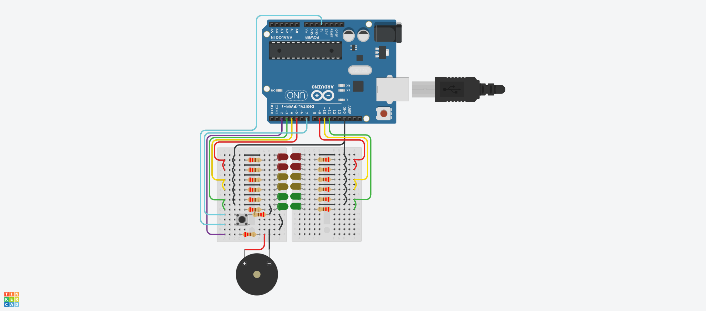

# Dojo N°1 (Parte 3) Semaforo

## Integrantes 
- Spatola Mateo
- Videla Ribodino Ivan
- Manzanares Patricio
- Quiroga Joaquin
- Santa Eulalia Matias

## Proyecto: Semaforo.

## Descripción
Este es el código correspondiente al Dojo 1 del Grupo C. En este código se utiliza un Arduino para controlar la iluminación de tres LEDs (Rojo, Amarillo y Verde) y un timbre. El objetivo del Dojo fue familiarizarse con la programación en Arduino y la interacción con componentes electrónicos.

Consignas Parte 3 (Nuevos requisitos):
- Agregar un botón (pull down) que al presionarlo se active la funcionalidad de luz verde con más tiempo, dándole a la persona que lo necesite más tiempo para cruzar la calle , sirve para la próxima luz verde y solo para la próxima luz verde después de presionar el botón. el tiempo se duplicará. 
-  Colocar dos semáforos de calles que se crucen  y programarlos para que funcionen en conjunto.

## Función principal

## :robot: Link al proyecto
- [Proyecto](https://www.tinkercad.com/things/9Vku32oaMTg)

> Recomendación: Al iniciar simulación bajar volumen.
